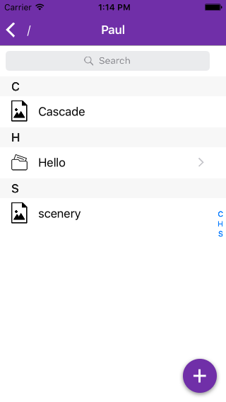
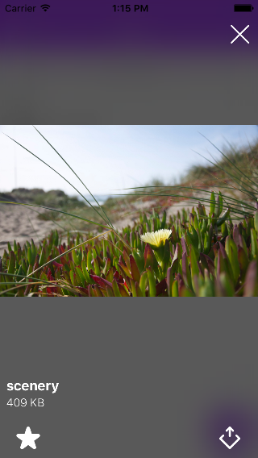

# LimaChallenge

## Features

### Mandatory features
All the mandatory features have been implemented:
- [x] Navigate "file system"
- [x] View media files (jpg, mp3, mp4)
- [x] Pull to refresh

### Additional features
- [x] Read text files (.txt, .log, .cue, .m3u, ...)
- [x] Read animated images (.gif)
- [x] Add directory
- [x] Upload picture (from library)
- [x] Take picture or video with camera
- [x] Landscape orientation for the media player (will display the media in full screen)
- [x] Empty state for directories with no content
- [x] Search inside a directory
- [x] Share a media
- [x] Save items (directories content) in cache, to retrieve them from one app launch to another
- [x] Mark an item as "favorite". It will save the file locally, and it won't have to be downloaded again until the remote file changes. This feature is only available for images and text files.

### Possible evolutions
- [ ] Delete a directory / file (as it was not in the specifications, I did not know if I was allowed to do it)
- [ ] Add a specific "Favorites" section at the root of the navigation, displaying all the items saved locally.
- [ ] Advanced network handling (e.g. retry a failed file upload when the network comes back)

## Technical informations
### Architecture
The app is written in Swift and is based on a [MVVM](https://www.objc.io/issues/13-architecture/mvvm/) architecture with a bit of Protocol-Oriented Programming and Reactive Programming.

The `ViewController` contains all the UI-related stuff (interface building and display, user actions catching).
It is linked to a `ViewModel`, which contains all the supporting logic.
The `ViewModel` makes all the operations/computations, using services via lazy dependency injection for domain specific tasks (networking, file system handling), and reactively updates the `ViewController` on changes.

The use of the [`RxSwift`](https://github.com/ReactiveX/RxSwift) framework may be a little overkill here, but I've used it anyway to show how useful it can be with this architecture pattern.

The items metadata are stored locally through CoreData, and the files content are persisted directly to disk.

### Implementation Details
When browsing a directory, here are the steps made by the app:
- display the cached data
- fetch the remote directory content (a list of `String`)
- make a diff between this list and the current directory content existing locally
- delete every item that doesn't exist anymore remotely (and their cached file if needed)
- fetch the metadata of every item in the remote directory
- if an item already exists locally, compare its modification time with the remote item's one
- if they have the same modification time, conclude that the file is the same, and do nothing
- if they have a different modification time, delete the local item and create a new one from the remote one

NB: the cache logic is therefore based on the `name` and `modification_time` fields of an item. While this is not ideal (albeit it should still be reliable), this is the only way to do it, given that remote items don't have identifiers.

When playing a media file:
- for the "usually light" items (text and images), the data is fully loaded first and then displayed
- for the heavier files (audio and video), the data is streamed directly in a player

## Dependencies (via Cocoapods)
- [RxSwift](https://github.com/ReactiveX/RxSwift)
- [RxCocoa](https://github.com/ReactiveX/RxSwift)
- [LGPlusButtonsView](https://github.com/Friend-LGA/LGPlusButtonsView)
- [FLAnimatedImage](https://github.com/Flipboard/FLAnimatedImage)

## Requirements
- iOS 9
